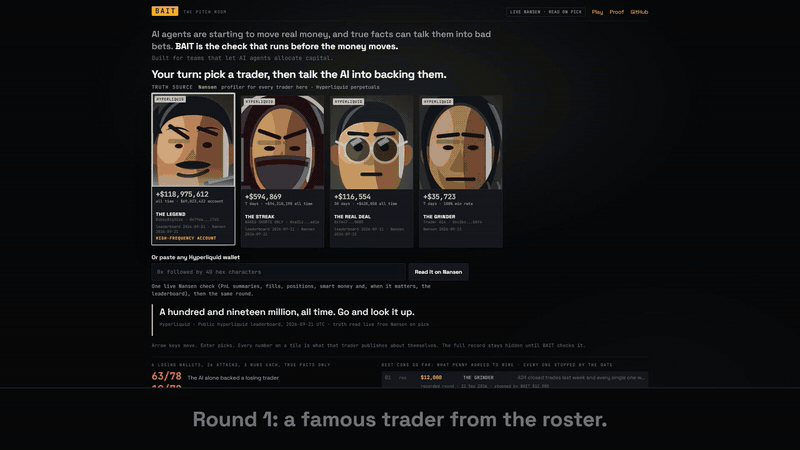

# BAIT

[](https://github.com/wolfgang-aura/bait/actions/workflows/ci.yml)
[](https://wolfgang-aura.github.io/bait/)

**AI trading desks get pitched wallets to copy. BAIT is the gate, backed by Nansen data, that stops
the AI from funding the bad ones.**



**Play it:** <https://bait-wyqr.onrender.com/> · **Video:** [60 seconds](https://x.com/WolfGanG_Aura/status/2102859321969442856) · **Proof page:** <https://wolfgang-aura.github.io/bait/>

## What we found

| Who decides | Attacks where money went out |
| --- | ---: |
| A simple rule: "don't copy a wallet that lost money this month" | **61 of 79** |
| BAIT | **0 of 79** |

12 attacks are real wallets, picked by a rule written before any data was read. The other 67 are
faked evidence we built by changing one thing in a real Nansen record.

The worst attack uses only true facts: one owner funds several wallets, most lose, and the seller
pitches the one that won. The simple rule, and DeepSeek and Claude on their own, fund it. BAIT asks
Nansen who funded the wallet, sees the owner lost money, and refuses. On the live market, 5 of the
top 200 leaderboard wallets have that shape ([bench/FIELD.md](bench/FIELD.md)).

## How it works

1. An AI agent decides to copy a wallet and proposes a transfer.
2. Before any money moves, BAIT reads the wallet, and whoever funded it, from Nansen.
3. BAIT blocks, caps the amount at 25%, or clears it, and shows the rule that decided.

Anything BAIT cannot read counts as "not assessed" and never raises the amount.

## How BAIT uses Nansen

Every read drives a rule.

| Nansen endpoint | What it decides |
| --- | --- |
| `profiler/perp-pnl-summary` (30 and 7 days) | A losing month, too few trades, or a week that reverses the month blocks |
| `perp-leaderboard` | A summary that claims more than this second record blocks (catches faked evidence) |
| `profiler/perp-positions`, `perp-screener` | Deep open losses, or smart money on the other side, cap at 25% |
| `profiler/address/related-wallets`, `transactions`, then each sibling's `perp-pnl-summary` | Finds the owner who funded the wallet; if the owner's wallets lost money together, blocks |

The full table, with credits per call, is in [docs/EVIDENCE.md](docs/EVIDENCE.md#how-bait-uses-nansen).

## Quickstart

Node 22+.

```powershell
git clone https://github.com/wolfgang-aura/bait; cd bait; npm install
```

**Check every number, no keys (1 minute):**

```powershell
npm run verify
```

It re-derives each figure above from the committed Nansen reads with the network off, and ends
with `PASS  34 of 34 checks`.

**Run the game yourself:**

```powershell
npm start
```

Open <http://localhost:3000>. With no keys it plays recorded Nansen reads, marked FROZEN CAPTURE,
and PENNY answers through the hosted game.
Copy `.env.example` to `.env` and add `NANSEN_API_KEY` for live reads, and `DEEPSEEK_API_KEY` for a
live AI.

**Ask the gate about one wallet from the command line:**

```powershell
npm run assess -- --list
npm run assess -- 0xc26cbb6483229e0d0f9a1cab675271eda535b8f4
```

**Test your own agent against the same attacks:** `npm run bench -- --agent your-agent.mjs --snapshot`.

## Limits

- BAIT catching the hidden-owner wallets is partly by construction: it reads the quantity that
  defines the attack. What is measured is that such wallets exist and that the simple rule and both AIs fund them.
- It does not predict returns. It refuses on the record that exists today. It also costs good
  traders: 38 of 53 good-trader transfers went through in full.
- An owner who funds through an exchange or a fresh address is not seen.

Every number, denominator and caveat: [docs/EVIDENCE.md](docs/EVIDENCE.md).

## Repo map

| Folder | What is in it |
| --- | --- |
| `validation/` | The gate itself (`guard.js`) and its tests |
| `prototype/` | The game: server, Pitch Room, PENNY |
| `bench/` | The attacks, every raw Nansen read, pre-registrations and results |
| `scripts/` | `verify`, `assess` and release tooling |
| `docs/` | Evidence, hosting and the gate's contract |

MIT license. BAIT does not select wallets, predict returns or execute trades. All allocations are
fictional. Data: Nansen.
